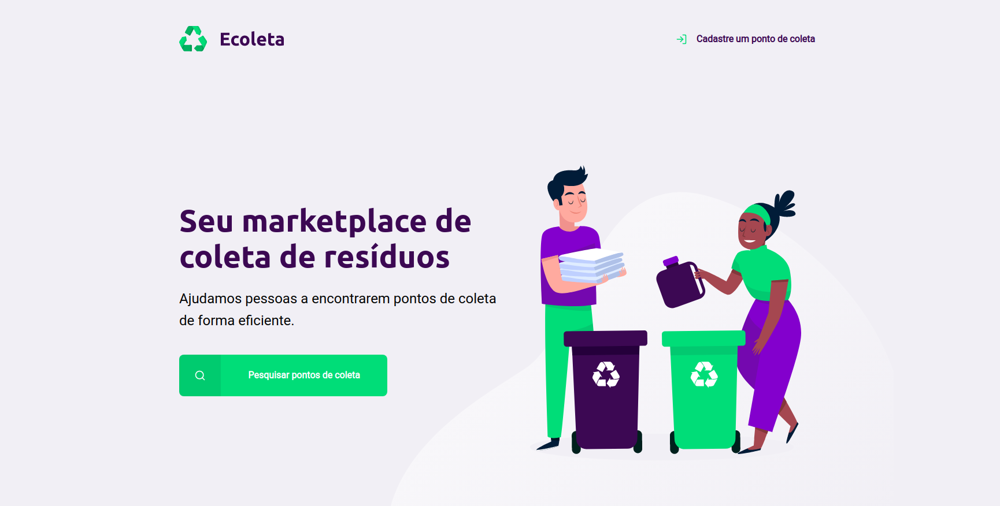
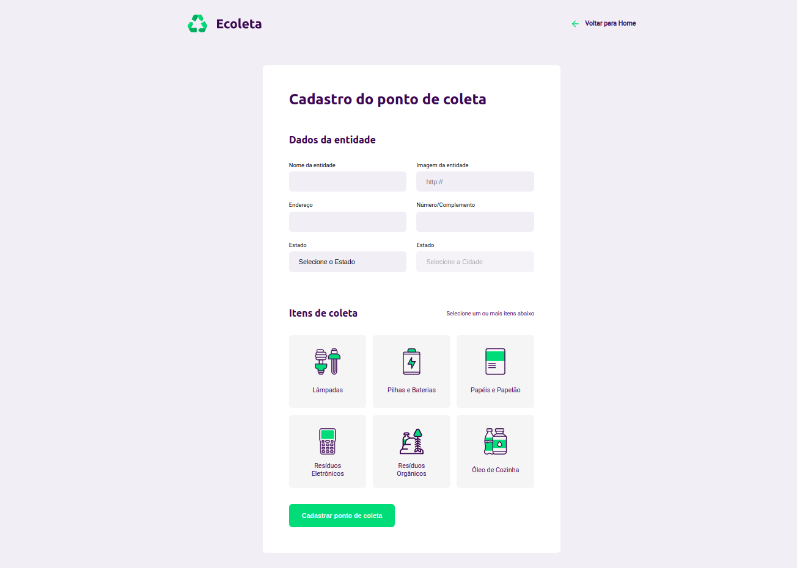
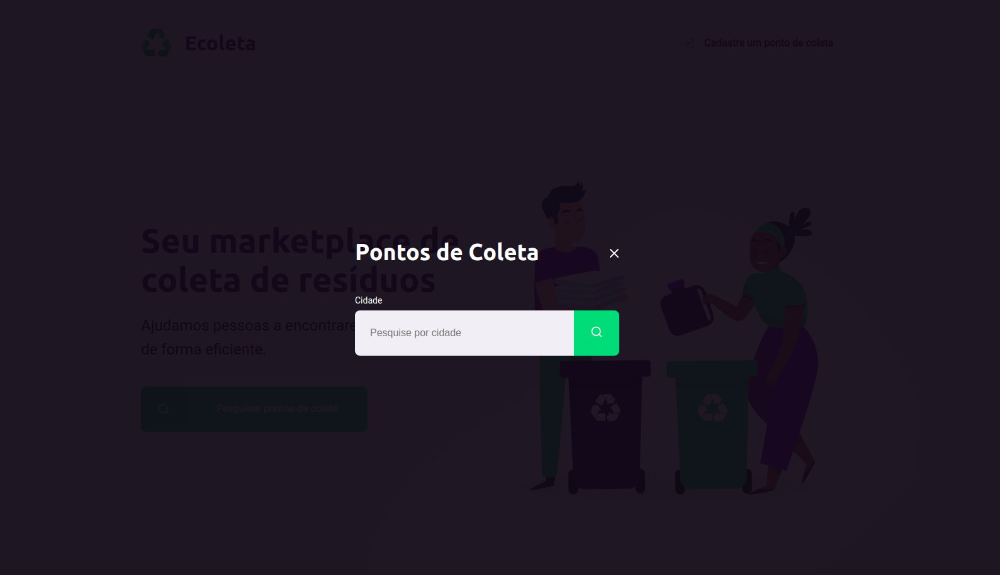

<h1 align="center">
  Next Level Week by 
</h1>
  

  

_________

### 🤔 Mas o que é isso? 
A NLW é uma experiência online criada pela Rocketseat de uma semana com muito conteúdo prático, desafios, hacks e um projeto que nos ajudam a avançar para o próximo nível e impulsionar a nossa carreira.

### ✨ Técnologias do projeto:
<ul>
    <li>HTML</li>
    <li>CSS</li>
    <li>Javascript</li>
    <li>SQLite</li>
</ul>
  
### ✨ Sobre o projeto:

O Ecoleta é um projeto criado para gerenciar o processo de coleta de lixo nas cidades. Com ele, é possível ajudar pessoas a encontrarem pontos de coleta de uma forma mais eficiente.

<h2>Página inicial</h2>
<h1 align="center">
   
</h1>

<h2>Página de cadastro</h2>
<h1 align="center">
  
</h1>

<h2>Modal de pesquisa</h2>
<h1 align="center">
   
</h1>

<h2>Página de pesquisa</h2>
<h1 align="center">
   
</h1>
